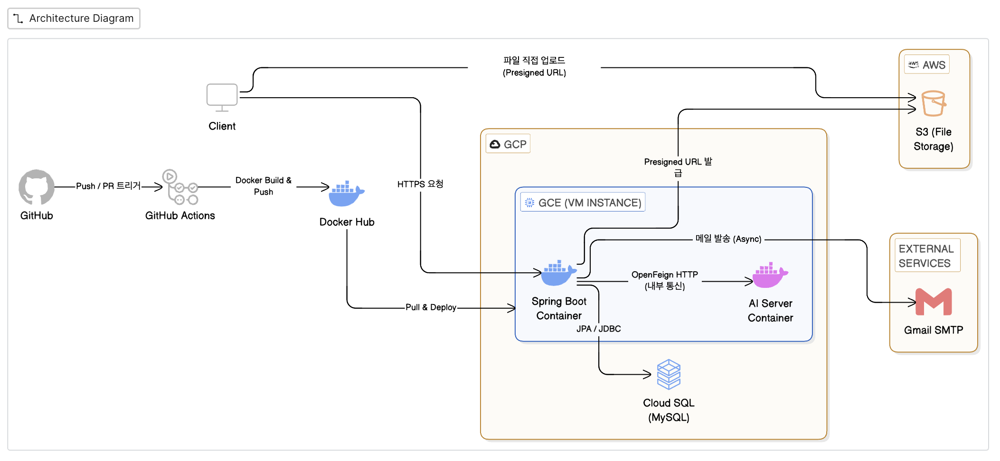
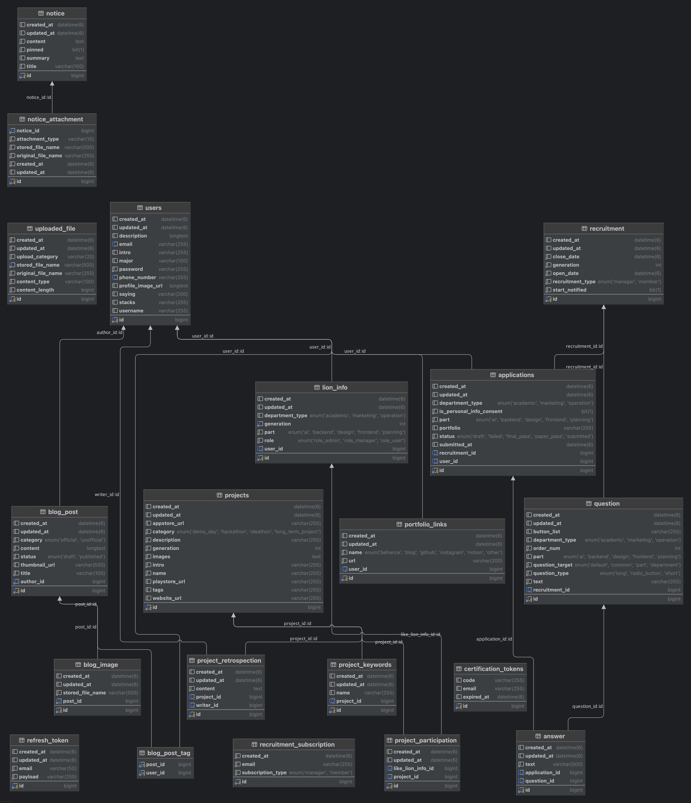

# 🦁 SNUT LikeLion 통합 관리 시스템 v2
> 서울과학기술대학교 멋쟁이사자처럼의 운영 효율화 및 데이터 통합 관리를 위한 백엔드 서비스

<br/>

## 1. 프로젝트 개요

- **개발 기간**: 2025.10 ~ 현재 운영 중
- **목적**: 신입 회원 모집 프로세스 자동화, 멤버 활동 이력 관리, 공지 및 콘텐츠 허브 구축
- **성과**: 2026년 14기 신입 회원 모집 시 실제 도입하여 안정적으로 운영, 공식 멋쟁이사자처럼 대학 본부 프로젝트 기재

<br/>

## v1 → v2 주요 개선 사항

[v1 레포지토리](https://github.com/LIKELION-SEOULTECH/snut-likelion-server) 대비 아래 항목을 개선·확장했습니다.

| 구분 | v1 | v2 |
| :--- | :--- | :--- |
| **AI 기능** | 없음 | AI 챗봇(intent 매핑) + 공지 자동 요약 추가 (OpenFeign) |
| **배포 인프라** | EC2 + Aiven(MySQL) | GCE + Cloud SQL, Spring Boot / AI 서버 Docker 컨테이너 분리 운영 |
| **파일 업로드** | 기본 S3 업로드 | Presigned URL 직접 업로드 + FileStorageType(이미지/파일) 분리 |
| **모집 알림** | 단순 알림 구독 | 기수별 구독 분리로 불필요한 알림 차단 |
| **비밀번호 재설정** | 링크 방식 | 이메일 인증 코드 입력 방식으로 UX 개선 |
| **테스트** | 미비 | 단위·통합(WireMock) 테스트 300개 이상, **서비스 레이어 JaCoCo 커버리지 92% 달성** |

<br/>

## 2. 시스템 아키텍처



## 3. ERD



<!--
권장 도구: ERDCloud / dbdiagram.io / MySQL Workbench
주요 테이블: users, recruitments, applications, answers, questions,
             certification_tokens, projects, blogs, notices, uploaded_files,
             recruitment_subscriptions
-->

<br/>

## 4. 기술 스택

| 분류 | 기술 |
| :--- | :--- |
| **Language / Framework** | Java 17, Spring Boot 3.4.5 |
| **Build** | Gradle |
| **DB / ORM** | MySQL, Spring Data JPA, QueryDSL 5.0 |
| **Security** | Spring Security, JJWT (Access / Refresh Token) |
| **Storage** | AWS S3 (Presigned URL) |
| **Messaging** | Gmail SMTP (비동기 메일 발송) |
| **External API** | OpenFeign (AI 챗봇 · 요약 서버 연동) |
| **DevOps** | Docker, GitHub Actions (CI/CD), GCE + Cloud SQL |

<br/>

## 5. 핵심 도메인 및 기능

| 도메인 | 주요 기능 | 관련 기술 |
| :--- | :--- | :--- |
| **Recruitment** | 기수별 동적 지원서 생성, 지원 상태 관리, 합격 발표 자동화, 기수별 모집 알림 구독 | Scheduler, QueryDSL |
| **Member** | 운영진/사자 권한 분리, 파트별 멤버 프로필 및 포트폴리오 관리 | Role-based Security |
| **Project** | 프로젝트 아카이빙, 카테고리별 검색 및 상세 조회 | QueryDSL |
| **Notice & Blog** | 공지사항·기술 블로그 게시판, AI 기반 공지 자동 요약, 파일·이미지 첨부 | OpenFeign, S3 |
| **AI** | 챗봇 intent 매핑 응답, 텍스트 요약 API | OpenFeign, Apache POI |
| **Auth** | JWT 기반 로그인, 이메일 인증 코드 기반 비밀번호 재설정 | JJWT, Gmail SMTP |

<br/>

## 6. 핵심 구현 사항

### S3 Presigned URL 업로드

서버를 경유하는 파일 업로드의 메모리·트래픽 비용을 없애기 위해 클라이언트 → S3 직접 업로드 방식을 도입했습니다.

**4단계 플로우**
```
[1] 클라이언트 → 서버: Presigned URL 발급 요청
[2] 서버 → 클라이언트: UUID 기반 S3 key 생성 + Presigned PUT URL 응답
[3] 클라이언트 → S3: Presigned URL로 파일 직접 업로드 (서버 우회)
[4] 클라이언트 → 서버: 업로드 완료 신고 → S3 실존 확인 후 메타데이터 저장
    (도메인 저장 시 UploadedFile 등록 여부 재검증으로 미완료 업로드 차단)
```

**핵심 설계 결정**
- **서버가 S3 key 직접 생성**: 경로 조작(Path Traversal) 방지, `{storageRoot}/{category}/{UUID}-{name}.{ext}` 형식 강제
- **key만 DB 저장, URL은 동적 생성**: CDN 변경·버킷 이전 시 마이그레이션 불필요
- **`FileStorageType` enum**: 이미지(`images/`) / 파일(`files/`) 경로 분리

적용 도메인: Blog · Project · Member 프로필 · Notice (이미지 + 일반 파일)

---

### JWT Access / Refresh Token 전략

탈취 리스크를 낮추기 위해 단기 Access Token + 장기 Refresh Token 이중 구조를 사용합니다. 서버 측에서 만료·유효성을 엄격히 검증하는 필터 계층을 구현하여 보안성과 사용자 경험을 동시에 확보했습니다.

---

### 이메일 인증 코드 기반 비밀번호 재설정

링크 방식 대신 6자리 인증 코드를 메일로 발송하는 방식으로 구현했습니다.

```
[1] POST /api/v1/auth/password/find?email=...
    → CertificationToken 생성 (UUID 6자리, 10분 유효)
    → Gmail SMTP로 인증 코드 발송 (비동기)

[2] PATCH /api/v1/auth/password/reset
    → { email, code, newPassword, newPasswordConfirm }
    → 코드 일치 + 만료 시간 검증 후 BCrypt 해시로 비밀번호 변경
```

---

### QueryDSL 동적 필터링

지원서·멤버 조회 시 파트·기수·상태 등 복합 조건을 `BooleanExpression` 단위로 모듈화하여 N+1 없이 안전하게 처리합니다.

---

### AI 챗봇 연동 (Port-Adapter 패턴)

`ai/` 도메인 패키지가 `infra/`를 직접 의존하지 않도록 포트 인터페이스로 분리했습니다.

```
AiQueryService
  ├── AiChatRepository (port) ←── AiChatRepositoryImpl (Feign)
  ├── AiSummaryRepository (port) ←── AiSummaryRepositoryImpl (Feign)
  └── IntentAnswerPort (port) ←── IntentAnswerResolver (Excel 인메모리 캐시)
```

- **챗봇 `/chat`**: AI 서버 오류 시 폴백 문구 반환 (HTTP 200 유지)
- **요약 `/summarize`**: AI 서버 오류 시 `AiException` throw (HTTP 503)
- **공지 자동 요약**: 요약 실패가 공지 등록을 막지 않도록 폴백 문구 저장

<br/>

## 7. 테스트 전략

**원칙**: 서비스 레이어는 외부 의존성(DB, S3, AI 서버)을 Mockito로 격리해 비즈니스 로직만 검증합니다. 실제 HTTP 통신이 필요한 경우에만 WireMock 통합 테스트로 검증합니다.

> **서비스 레이어 JaCoCo 커버리지 92% 달성** (2971 / 3230 instructions, JwtService 4% 포함)

| 테스트 클래스 | 종류 | 핵심 검증 |
| :--- | :--- | :--- |
| `ApplicationCommandServiceTest` | 단위 | 지원서 생성·수정·삭제 비즈니스 규칙 |
| `AuthServiceTest` | 단위 | 비밀번호 재설정 인증 코드 검증, 회원가입, 비밀번호 변경 |
| `FileUploadServiceTest` | 단위 | Presigned URL 발급·완료·검증 전 단계 |
| `JwtServiceTest` | 단위 | 토큰 발급·검증·갱신·쿠키 설정 |
| `ProjectCommandServiceTest` | 단위 | Presigned 기반 프로젝트 생성·수정·이미지 삭제 |
| `ProjectRetrospectionServiceTest` | 단위 | 회고 생성·조회·삭제 전 단계 |
| `BlogCommandServiceTest` | 단위 | 게시글 생성(임시저장/발행)·수정·삭제·초안 삭제 |
| `MemberQueryServiceTest` | 단위 | 멤버 조회·기수별 필터링·검색·LionInfo 상세 |
| `AiQueryServiceTest` | 단위 | 인텐트 매핑·폴백 조립 |
| `AiIntegrationTest` | 통합 (WireMock) | AI 기능 E2E 흐름 |
| 관리자 서비스 (Blog·Notice·Project·Member) | 단위 | 위임 호출·목록 페이지네이션 검증 |
| 기타 (Auth Mail, Notification, Subscription 등) | 단위 | 각 도메인 서비스 로직 |
